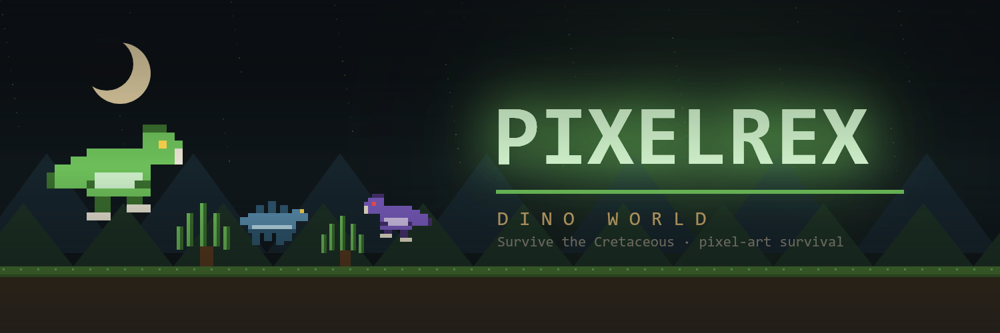
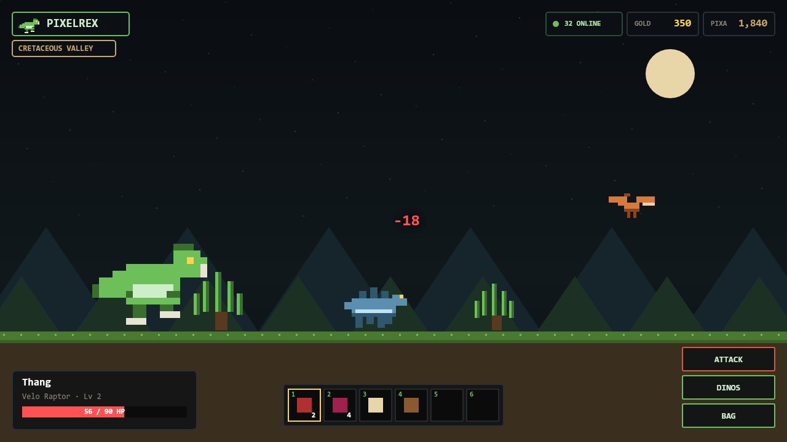
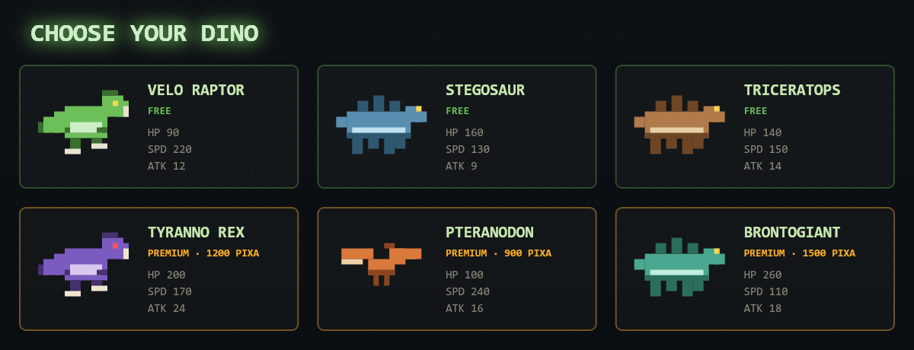

<p align="center">
  
</p>

<h1 align="center">🦖 PixelRex — Dino World</h1>

<p align="center">
  A pixel-art dinosaur survival sandbox set in a side-scrolling Cretaceous valley.<br/>
  Built with <b>Vite + React + Phaser</b> — every sprite is generated procedurally in code.
</p>

<p align="center">
  <a href="https://pixelt-rex.github.io/pixelrex/"><b>▶ Play the live demo</b></a>
  &nbsp;·&nbsp;
  
  
  
</p>

---

## 🎮 Gameplay

<p align="center">
  
</p>

Pick one of six dinosaur species, then hunt wild dinos, gather resources, trade
on the marketplace, complete quests and level up your beast across an open valley
with parallax backdrops, a day cycle and roaming wildlife.

## 🦕 Choose your dinosaur

<p align="center">
  
</p>

## ✨ Features
- 🌋 Side-scrolling open valley — parallax backdrops, day cycle & roaming wild dinos
- ⚔️ Real-time combat, gathering, health & XP / skill progression
- 🦕 6 playable species (free + premium) with unique stats
- 🛒 Marketplace, inventory, quests, skills & a rewards leaderboard
- 🟢 **Login** flow (stands in for wallet connect) — unlocks the PIXA balance and premium dinos
- 🎨 Original pixel sprites generated entirely in code (no external image assets)

## 🚀 Run locally
```bash
npm install
npm run dev   # http://localhost:5173
```

Build for production:
```bash
npm run build
npm run preview
```

## 🎮 Controls
| Key | Action |
| --- | --- |
| `A` / `D` or `←` / `→` | Move |
| `W` / `↑` | Jump |
| `Space` | Attack nearby dinos |
| `E` | Gather from ferns, rocks, bones & nests |
| `F` | Eat selected hotbar food to heal |
| `1`–`6` | Select hotbar slot |

## 🗂️ Project structure
```
src/
  store.js          # global game state (zustand) — login replaces wallet connect
  App.jsx           # boot → login → game flow
  ui/               # AuthScreen, HUD, panels, chat, icon generators
  game/             # Phaser game mount + world scene + procedural sprites
  data/             # dinos, items, quests, market seed data
tools/
  make-brand.mjs    # generates the banner, avatar, gameplay & roster art
brand/              # generated promo / repo images
```

## 📝 Notes
This is a single-player demo. The online count, chat and PIXA/Gold balances are
simulated locally — the **Login** button takes the place of a wallet connect and
grants the equivalent "connected" state (address, PIXA, premium access).

---
<p align="center"><i>Original project — code and pixel art generated from scratch.</i></p>
